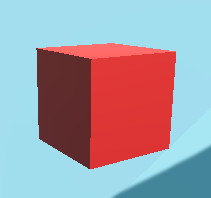
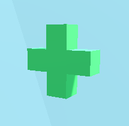
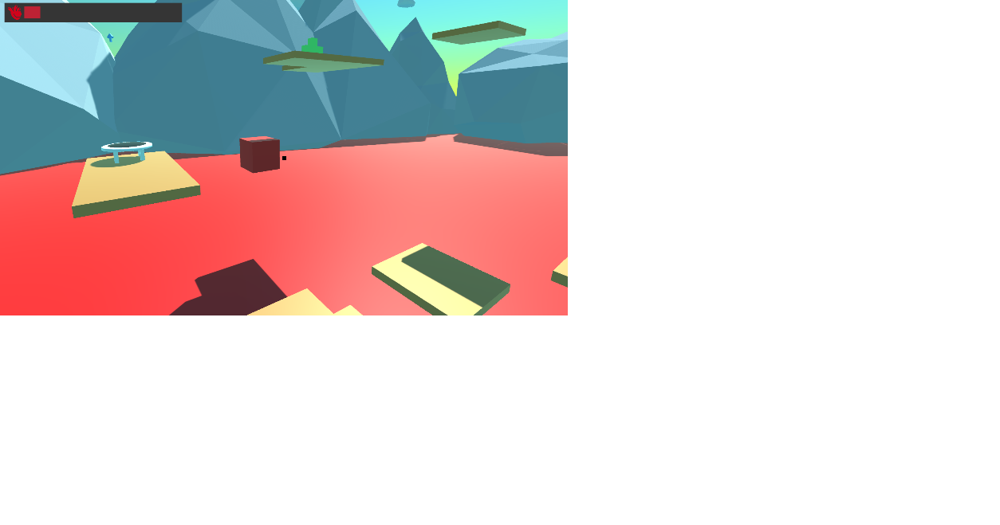

# YJDungeon
**Only Up 스타일의 3D 점프 게임**

Unity 2022.3.17f1 기반의 3D 물리 점프 게임입니다.  
플레이어는 발판과 점프패드를 이용해 높은 곳까지 올라가며,  
다양한 아이템을 통해 체력 회복 또는 이동 속도 증가 등의 효과를 받을 수 있습니다.

---

## 🎮 주요 기능

- WASD 이동, 마우스 회전, Space 점프
- 충돌형 상호작용 시스템 (아이템에 닿으면 즉시 효과 발동)
- 힐 / 스피드업 아이템 시스템
- 일정 시간 후 아이템 리스폰
- 장애물에 닿을 시 피해 처리 및 체력을 모두 소진하면 게임 오버
- 게임오버 / 클리어 연출

---

## 💼 게임 내 아이템 소개

| 아이템 | 설명 |
|--------|------|
|  | **장애물**: 닿을 때마다 1초 간격으로 **10의 피해**를 입습니다. 피해서 이동해야 합니다. |
|  | **체력 회복 아이템**: 획득 시 **체력 20을 회복**합니다. |
|  | **이동속도 증가 아이템**: 획득 시 **5초 동안 이동 속도 +5** 증가 효과가 발생합니다. |

> 아이템은 플레이어가 닿는 순간 작동하며, 이후 10초 뒤에 자동으로 재생성됩니다.

---

## 🖼️ 게임 화면 예시

  

_점프패드와 발판을 이용해 올라가는 모습_

---

## 🔧 개발 환경

- Unity 2022.3.17f1
- TextMeshPro
- Input System
- Git Version Control
- Visual Studio 2022
