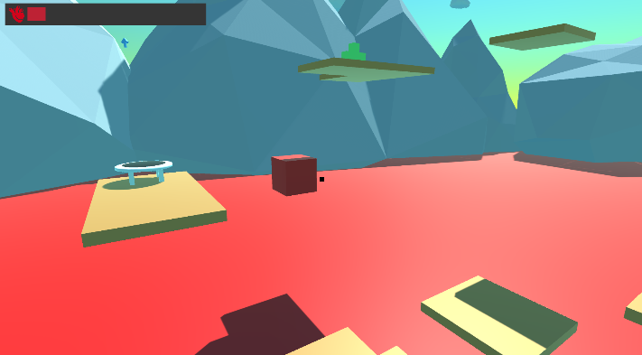

# 🧗‍♂️ YJDungeon  
Only Up 스타일의 3D 물리 점프 게임

Unity 2022.3.17f1 기반의 점프 게임으로,  
플레이어는 발판과 점프패드를 활용하여 점점 더 높은 곳으로 도전하고,  
아이템을 활용하여 체력을 회복하거나 이동 속도를 상승시킬 수 있습니다.

---

## 🎮 주요 기능

- WASD 이동, 마우스 회전, Space 점프
- 충돌 기반 상호작용 (아이템에 닿으면 즉시 효과 발동)
- 힐 / 스피드업 아이템 시스템
- 일정 시간 후 아이템 자동 리스폰
- 장애물 충돌 시 체력 감소 → 체력이 0이 되면 게임 오버
- 게임 클리어/오버 TextMeshPro UI 연출

---

## 🧰 게임 내 아이템 소개

<table>
  <tr>
    <th>아이템</th>
    <th>설명</th>
  </tr>
  <tr>
    <td></td>
    <td><strong>장애물</strong>: 닿을 때마다 1초 간격으로 <strong>10의 피해</strong>를 입습니다. 피해서 이동해야 합니다.</td>
  </tr>
  <tr>
    <td></td>
    <td><strong>체력 회복 아이템</strong>: 획득 시 <strong>체력 20을 회복</strong>합니다.</td>
  </tr>
  <tr>
    <td></td>
    <td><strong>이동속도 증가 아이템</strong>: 획득 시 <strong>5초 동안 이동 속도 +5</strong> 증가 효과가 발생합니다.</td>
  </tr>
</table>

> 아이템은 플레이어가 닿는 순간 작동하며, 이후 10초 뒤에 자동으로 재생성됩니다.

---

## 🖼️ 게임 화면 예시

_점프패드와 발판을 이용해 올라가는 모습_

---

## 🛠 개발 환경

- Unity 2022.3.17f1
- TextMeshPro
- Input System
- Git version control
